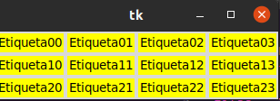
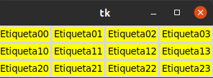
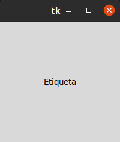

# 1. posicion y diseño

## gestor de geometria
#### este gestor de geometria distribuye los widgets en horrizontal o vertical.

## gestor de geometria grid

#### con grid la distribucion de los widgets se realiza de una manera mas flexible, utilizando un diseño de cuadricula. De esta manera, cada widget en la celdas determinadas por la interseccion de una fila y una columna

## gestor de geometria place

#### este gestor permite colocar los widgets en cordenadas especificas de la ventana principal o del widget contenedor

