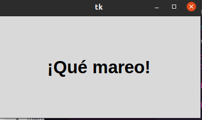
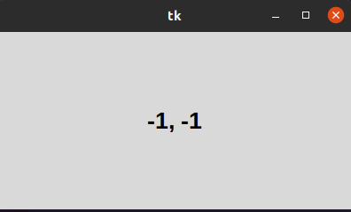
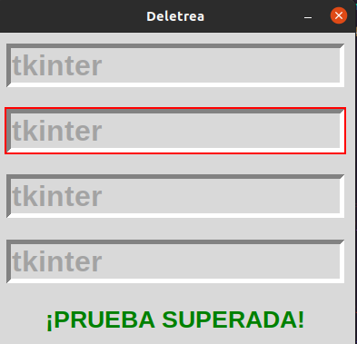

# 3 metodos comunes 

### temporizadores 

#### este metodo funciona para hacer que una frase o oracion se pueda encojer o agrandar 

#
### posicion del raton

#### este metodo nos deja ver la posicion en la que esta parada la flecha del raton

#
### foco

#### este nos habre una ventana el la cual habran 4 reglones los cuales tendremos que pegar la palabra tkinder pero el cursor se movera aletoriamente haciendo mas dificil la tarea 
#
