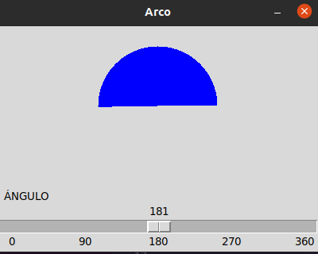
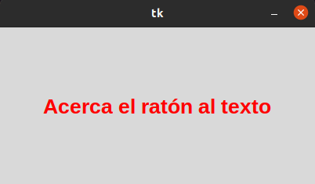
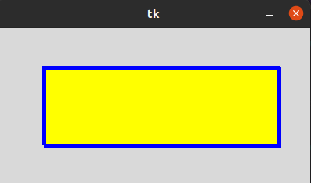
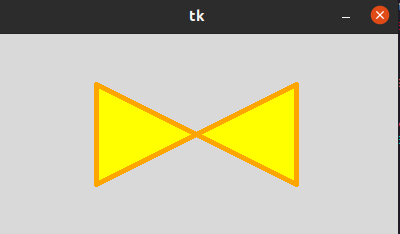
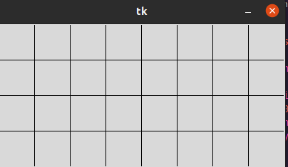
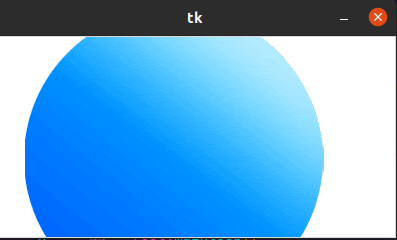
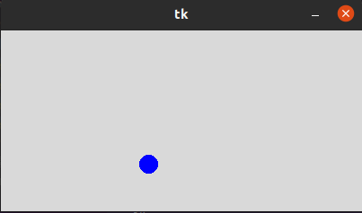
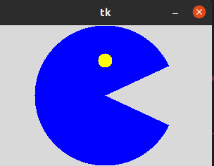

# canvas
#
## scales arco
#
#### aqui podemos observar un boton es cual si deslizamos con el cursor a la derecha o a la izquierda se nos mostrara en la pantalla un angulo y esto cambia dependiendo de los grado que escojamos
#

#
## canvas text
#
#### podemos hacer que las palabra se resalten al tocarlas con el cursor
#

#
## canva rectangulo
#
#### con este codigo le podemos dar forma a un rectangulo
#

#
## canva poligono
#
#### con este codigo le podemos dar forma a un poligono

poligono.png

#
## canva linea
#
#### con este codigo podemos tener lines y la cual nos sirve para tener una cuadricula 

#
## canva imagen
#
#### en este canva se puede añadir cualquier gif o imagen el cual nos dejara animar esa foto
#

#
## canva circulo
#
#### con este codigo no podemos crear una pelota  la cual rebotara con el borde del cuadro 

#
## canva arc
#
#### con esta canva podemos construir un pacman el cual movera su boca, haci le podriamos dar vida a otras figuras
#

