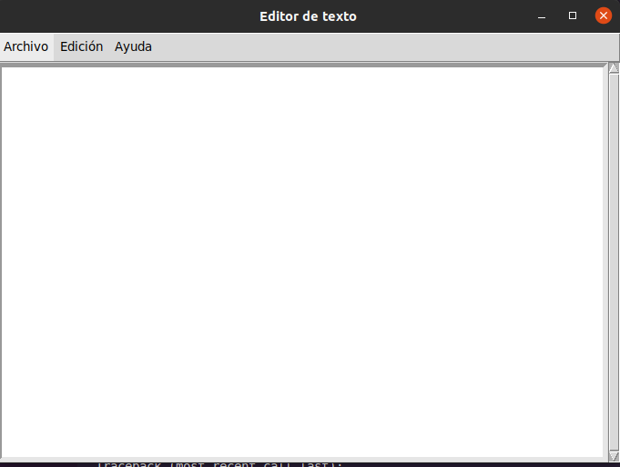

# 10 tipos de widgets
#
## scroll
#
#### podemos tener un editor de texto el cual tiene funciones  como guardar archivo y ayuda
#

#
## scale arco
#
#### aqui podemos observar un boton es cual si deslizamos con el cursor a la derecha o a la izquierda se nos mostrara en la pantalla un angulo y esto cambia dependiendo de los grado que escojamos
#

#
## option menu
#
#### en este widget podemos encontrar un formulario el cual nos deja poner informacion en  unos cuadros 
#

#
### message box
#
#### ente widget nos dejara habrir una barra de opciones que nos permite hacer ciertas funciones
#

#
### menu button
#
#### en este widget nos permite añadir otro boton el cual nos permite saber que sexo es la persona que llena el formulario
#

#
## reloj
#
#### este widget nos permite hacer un reloj el cual marca la hora en tiempo real
#

#
## button
#
#### con este widget podemos darle vida a los botones en el ejemplo podemos ver como iniciar el conteo de un cronometro y decomo podemos detener el conteo
#

#
## listbox
#
#### en este widget podemos observar un traductor el cual podemos hacer traducciones de algunos idiomas 
#

#
## entry
#
#### este widged nos funciona para simular que vamos a abrir una cuenta
#

#
## menu
#
#### sirve para abrir un menu en el cual nos dara unas opciones para escoger
#
